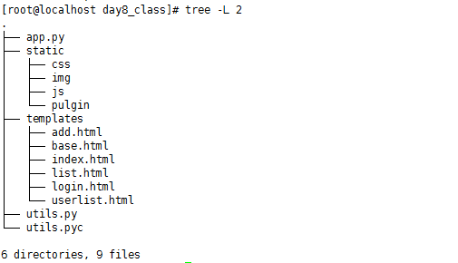

## 第八节上课内容：

#### HTML：
	form:负责V端用户输入数据，并传到C端
	table:渲染/展示M端数据
	div:把form table放到页面好看的位置--布局
### CSS：页面化妆
	<style="color:red">

### bootstrap:HTML+CSS
    1.引入CSS
    2.表格、表单、按钮、文件
    3.栅栏-布局 12宫格 

    4.框架模板集成 
        定义框架：base.html中添加
                 
        调用：login.html中
                
                
                
                
#### JS:java scirpt代码 
    1.who 操作谁 选择器:元素/ID/class/
    2.how 怎么操作  action 动作
    3.when 什么时间操作 event

#### JQuery基本语法：
    Jquery语法是为HTML元素的选组编制的，可以对元素执行某些操作
    格式：
    
    基本语法是：
        $(selector).action()
        1.$美元符号定义jQuery
        2.选择符（selector）查询和查找HTML元素
        3.action()执行对元素的操作
 	    eg:jquery选择符与CSS样式想温和
 		    $(this).hide() ---隐藏当前元素
 		    $("p").hide() ---隐藏所有P段落
#### 小栗子
    <html>
    <body>
    
我将被jquery传来的数据覆盖

    
我将被jquery传来的数据覆盖

    
我不想被传来的数据覆盖

    
我想修改颜色

    
我也想修改颜色

    <button class="btn btn-success" type="button">Click me</button>
    </body>
    
    </html>

#### JQuery核心三要素，选择器 动作 事件 function jquery()
	选择器
	    $('元素名').动作：元素选择器， 所有HTML的标签元素都可以作为选择器，慎重选择
	    $('id').动作：ID选择器，每一个被操作的标签，都必须定义一个唯一的ID，非常常用，适用于单个元素的操作
	    $('.class'):类选择器，会同时对这个类名的元素批量操作，适用于同类元素批量操作

#### 重要知识点
    1.JS与JQ：js是基础，jq是建立在js的基础上，用js开发出来的一个框架，里面实现和很多常用的功能和效果。只要了解其中方法的含义，我们使用的时候直接调用就可以了
    2.jq定义格式 语法$("选择器").click(动作)(funtion())
    3.js 提交表单后：return false（表单默认不在提交，只提交一次post请求）
    4.
 
## 第八节作业：
### 需求
    美化页面，用js、框架模板套用、模态框、实现登录 注册 用户管理(添加/修改/删除)

### 项目分析：
    1.V端：访问网站直接跳转到登录界面
      C端：判断是否有session登录，没有直接返回login.html
    2.C端返回：login.html 
      V端：提交表单(JS提交)
      C端：查询M数据库用户名密码是否正确，返回信息给V端
      V端：接受信息，根据C端返回的信息,判断返回信息
    3.C端：返回list.html页面
      V端：判断用户角色，根据角色显示不同的页面
        if role==0,管理员用户可以看到用户列表
        else，普通用户，只能看到个人信息  
    4.管理用户：添加用户、查看用户、更新用户信息、删除用户
        v:JS:$.post("/userlist/",URL,funtion(result))提交表单，获取C端口返回数据，将数据result转成JSON(JSON.parse(result))格式，ajex判断，返回信息给页面（动态框显示）
        C:获取JS提交表单
###  项目实现：登录（登录为例，其他略）
        <!--表单定义提交用户信息 -->
        <form id="loginForm" method="post">
                

                    <input id="username" type="text" name="username" class="form-control" placeholder="Username" required="length[6~50]">
                

                

                    <input id="password" type="password" name="password" class="form-control" placeholder="Password" required="">
                

                <button id="loginbtn" type="submit" class="btn btn-primary block full-width m-b">登录</button>
    </form>
    <!--表单定义end-->
    <!--JS处理-->
    
#### 项目结果（略：第七节课作业显示图一样，js实现）
    --
#### 目录结构
 

