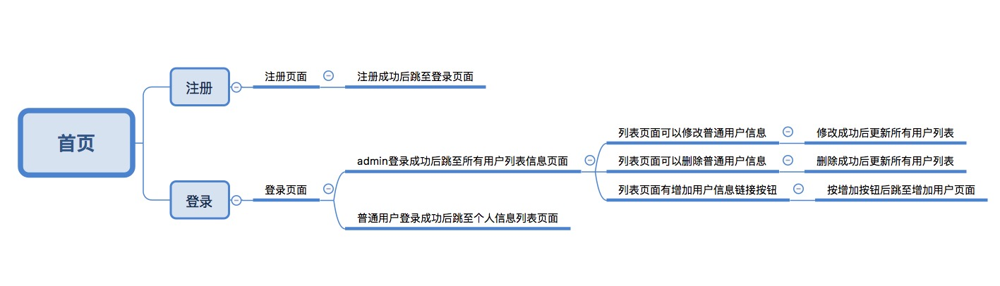
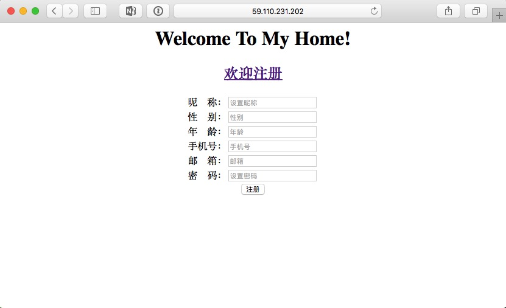
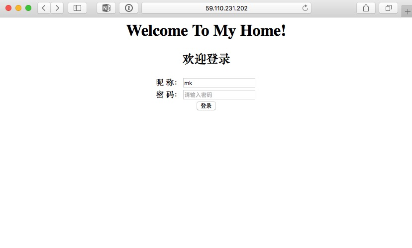
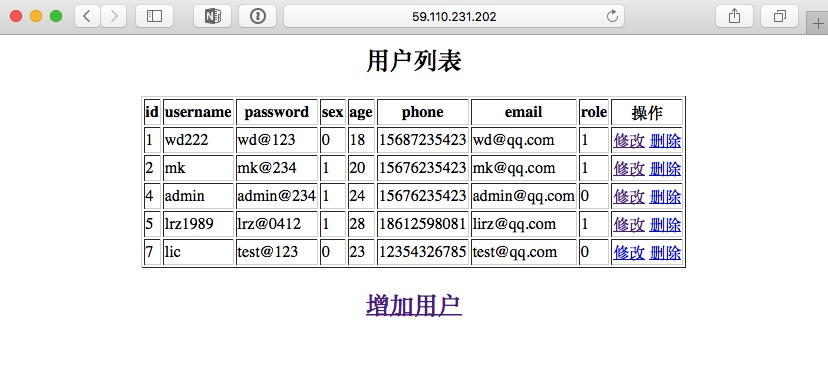
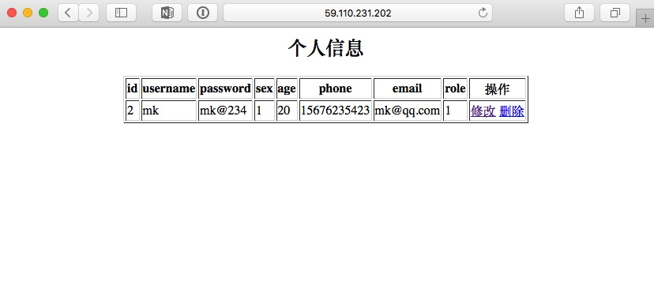
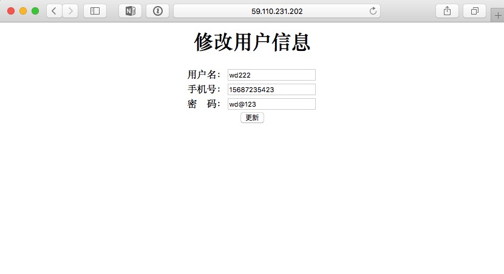
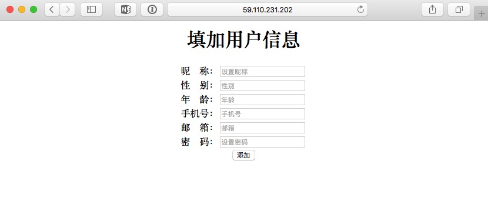

# 第五天作业

## 作业：连接数据库增删改查用户信息

### 项目分析：
* 要有六个页面（首页，注册页面，登录页面，所有用户信息列表页面，个人信息列表页面，增加用户信息面）
* 首页（显示欢迎信息，注册链接，登录链接）
* 注册页面（昵称，性别，年龄，手机号，邮箱，密码）
* 登录页面（昵称，密码）
* 所有用户信息页面（admin账号登录后，跳转至此页面，显示所有用户信息列表）
* 个人信息列表页面（普通账号登录成功后，跳至个人信息列表页面）
* 增加用户信息页面（添加用户信息，添加成功后，返回至所有用户信息页面）

### 逻辑结构：


### 目录结构：
```
app/
├── app.py
├── db.py
├── __init__.py
├── static
│   └── index.jpeg
├── templates
│   ├── adduser.html
│   ├── index.html
│   ├── login.html
│   ├── register.html
│   ├── update.html
│   ├── userinfo.html
│   └── userlist.html
└── utils.py
```
* app.py 为主函数
* utils.py 为工具函数
* db.py 为数据库封装函数

### 页面展示：












