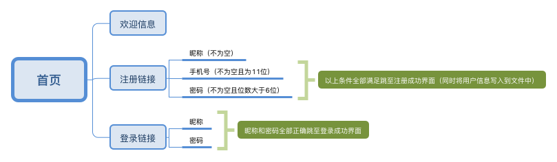
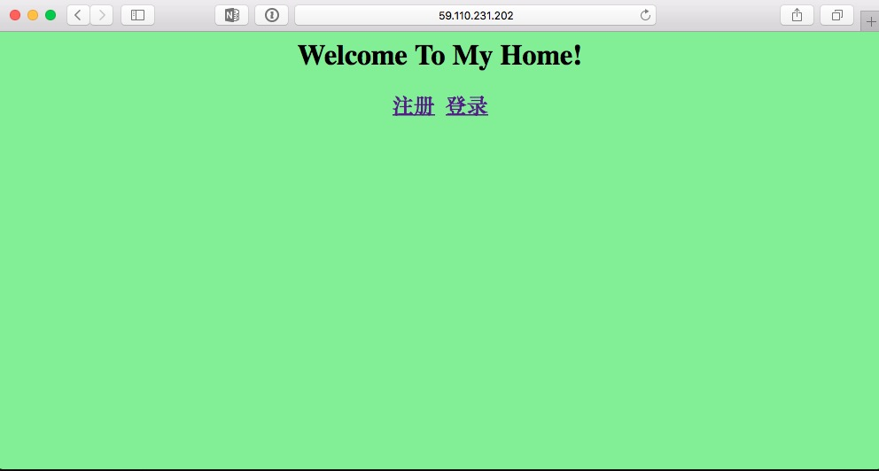
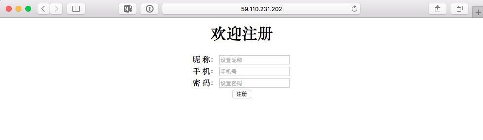
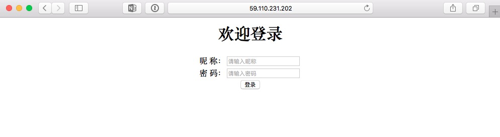
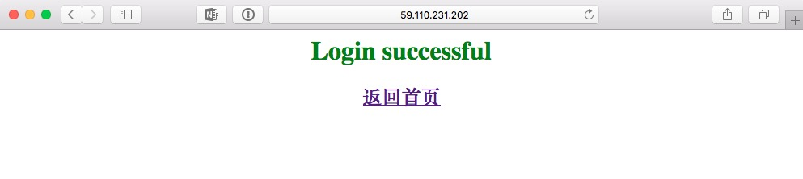

# 第四天作业

## 作业：用户注册登录界面

### 项目分析：
* 要有四个页面（首页，注册页面，登录页面，注册/登录成功页面）
* 首页显示欢迎信息，注册链接，登录链接
* 注册页面（昵称，手机号，密码）
* 登录页面（昵称，密码）
* 成功页面（成功信息，返回首页链接）

### 逻辑结构：


### 目录结构：
```
[root@LearnPython liruizhong]# tree app
app
├── app.py
├── judge.py
├── templates
│   ├── index.html
│   ├── login.html
│   ├── register.html
│   └── successful.html
└── user_file
```
### 页面展示：
* 首页



* 注册页



* 登录页



* 成功页


