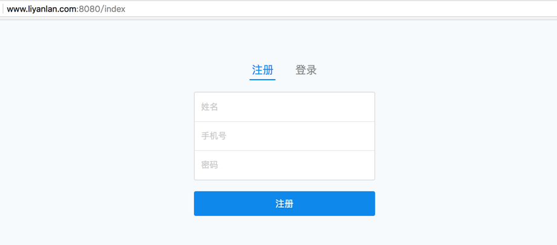
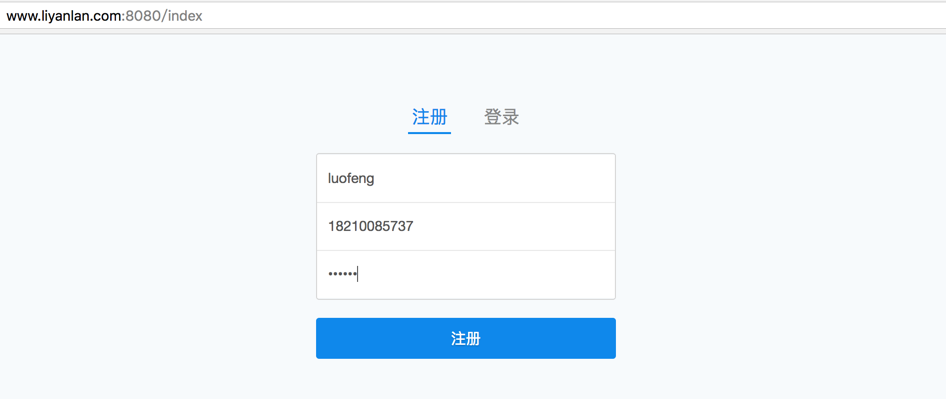
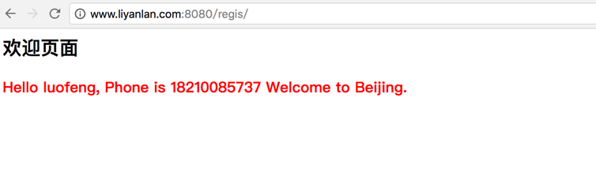
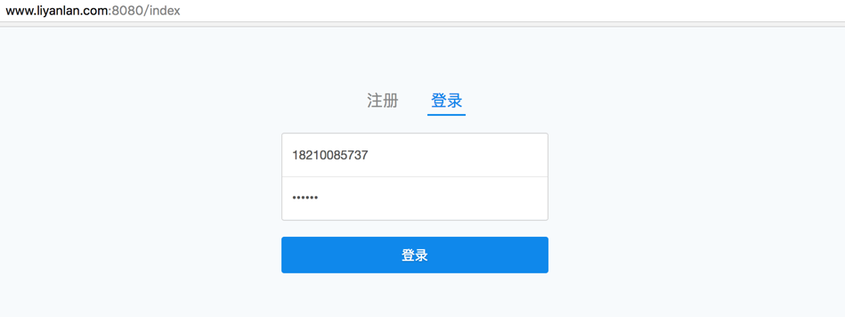
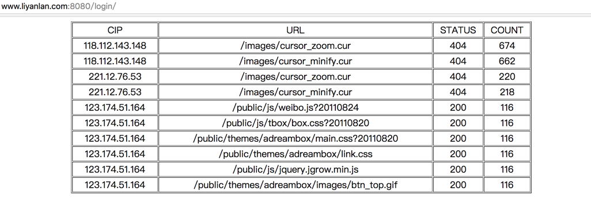
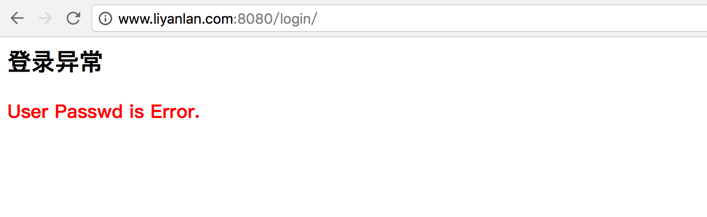

# 作业

# 需求

### 目录结构：
```
# tree luofeng/
luofeng/
├── app
│   ├── run.py
│   ├── static
│   │   └── css
│   │       └── main.4df360a5.css
│   ├── templates
│   │   ├── error.html
│   │   ├── index.html
│   │   ├── login.html
│   │   ├── regis.html
│   │   └── success.html
│   └── user_information.txt
├── images
│   ├── index.png
│   ├── user_login1.png
│   ├── user_login2.png
│   ├── user_login3.png
│   ├── user_regis1.png
│   └── user_regis2.png
└── README.md
```
### 作业展示
* 首页



* 注册



* 登录



