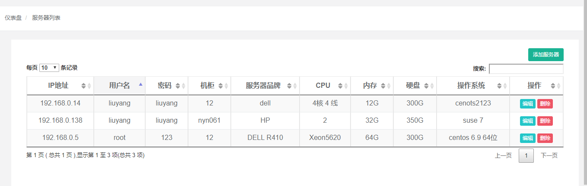
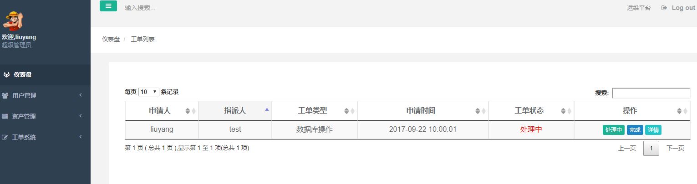

#### 第九天作业
    1.简单CDMDB（工单详情和更改状态暂未实现）
    2.优化页面
    
#### 涉及知识
    1.模块调用（db.py util.py ）
    2.日志记录模块（Loggers模块）
    3.traceback日常处理
    
#### 目录结构

#### 网页访问日志

#### 网页访问展示
##### 登录页面

##### 个人中心页面

##### 修改个人信息

##### 管理员用户列表

##### 管理员添加用户

##### 管理员删除用户

##### 机房列表

##### 添加机房

##### 机柜列表

##### 添加机柜

##### 服务器列表

##### 服务器添加

##### 服务器更新

##### 工单申请

##### 工单列表

##### 工单历史

