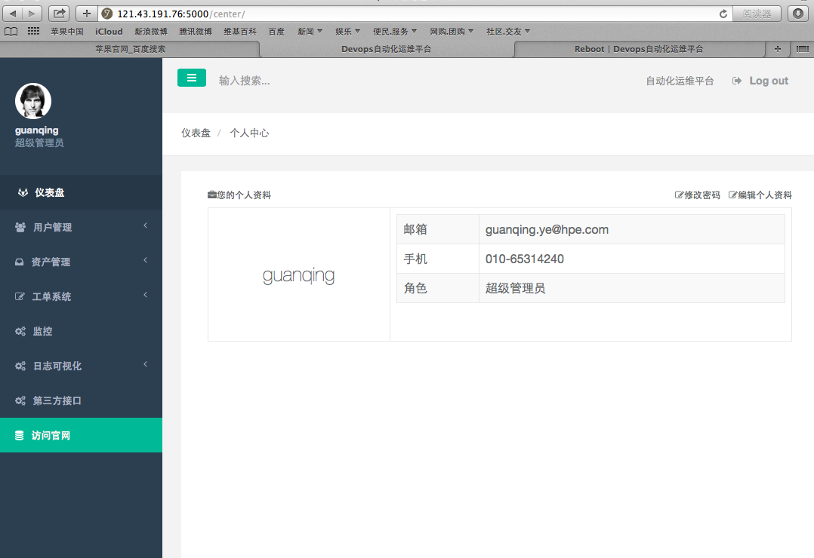
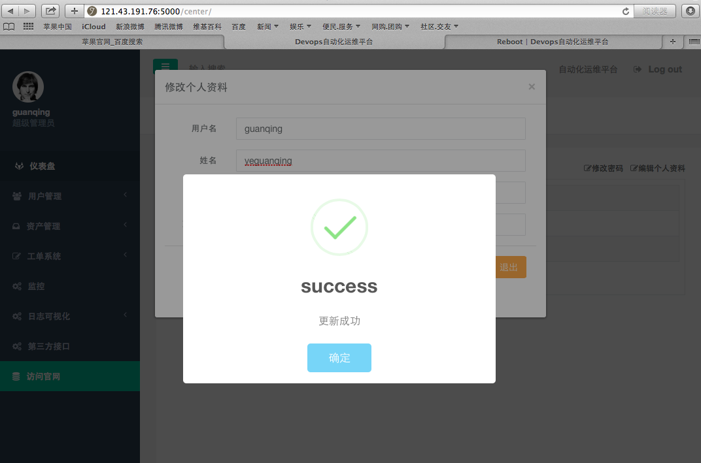
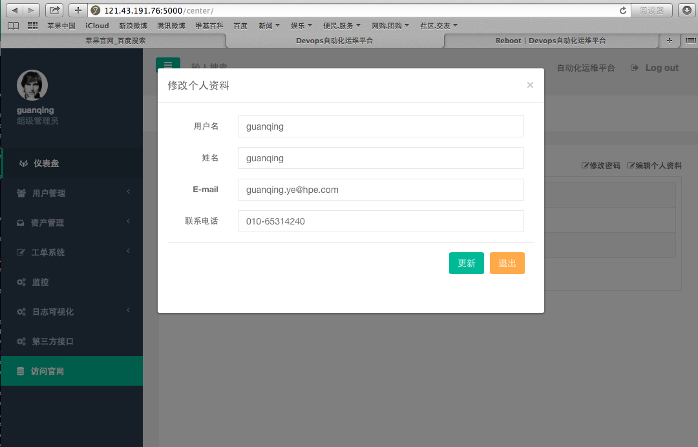
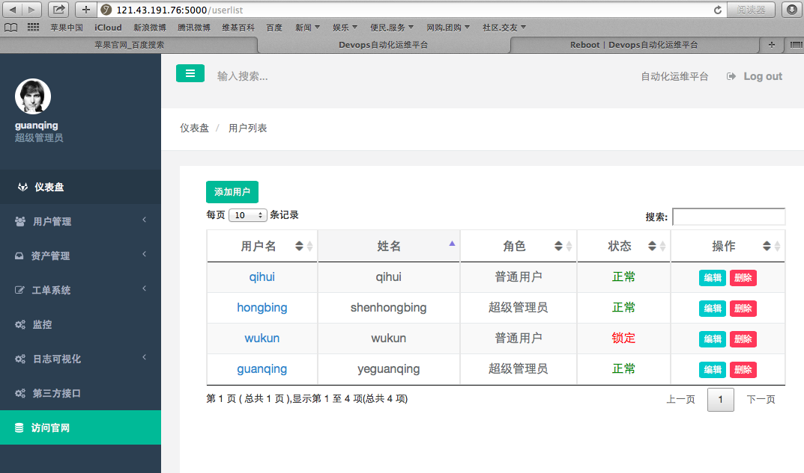
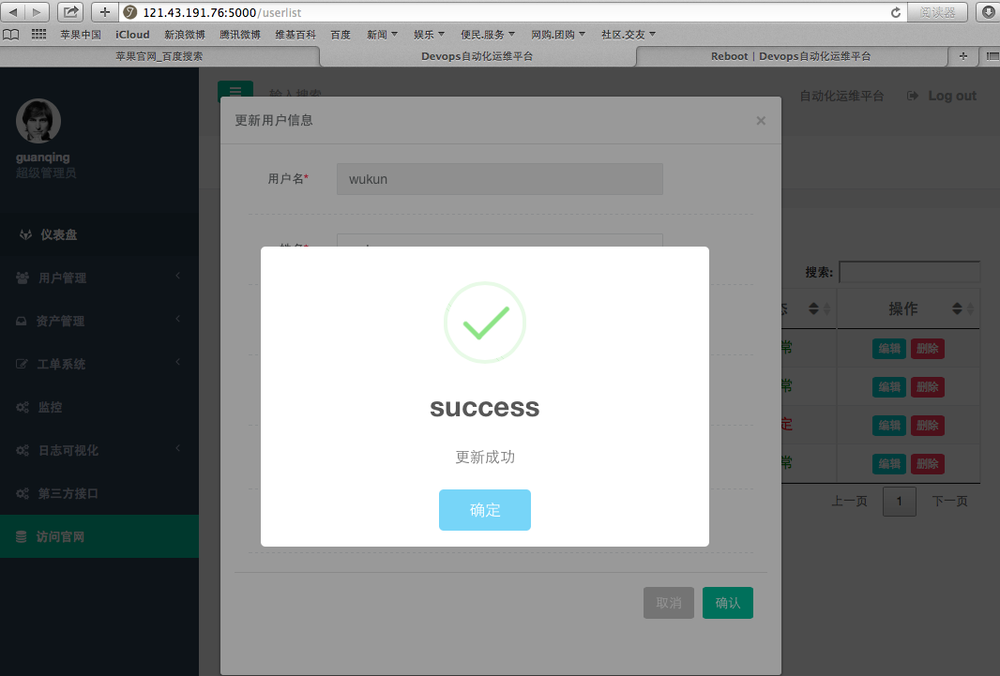
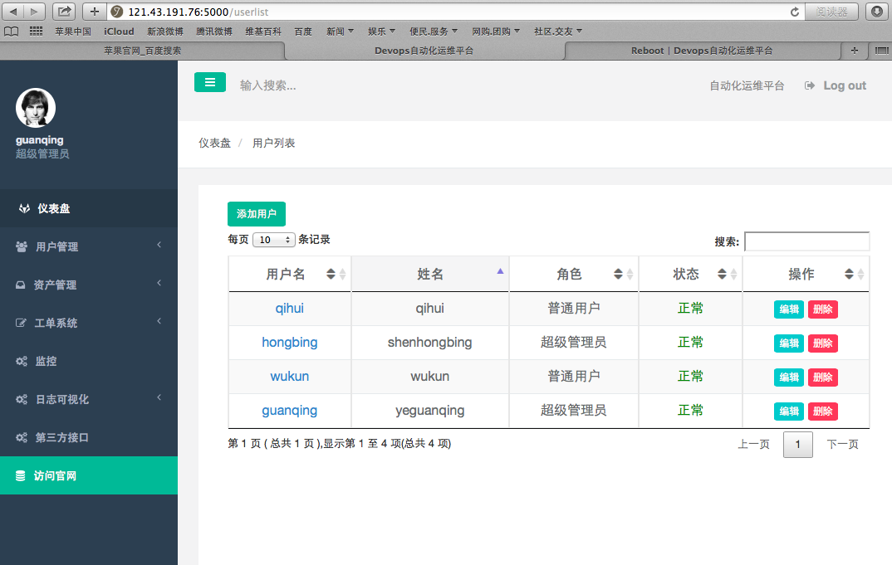

### 作业

*  简单的CMDB （由于上节课有事不在，通过视频学习实现了用户的CMDB管理以及模态框的使用和日志记录模块）
*  页面的优化

### 目录结构:

* app.py 为主函数
* utils.py 为工具函数
* config.py 为配置文件
* log_output.py 为logging模块
* sessions.py 为session模块
* user.py 为用户函数
* templates 为扒来页面的html
* static 为扒来的各种模块插件

### 页面展示:

