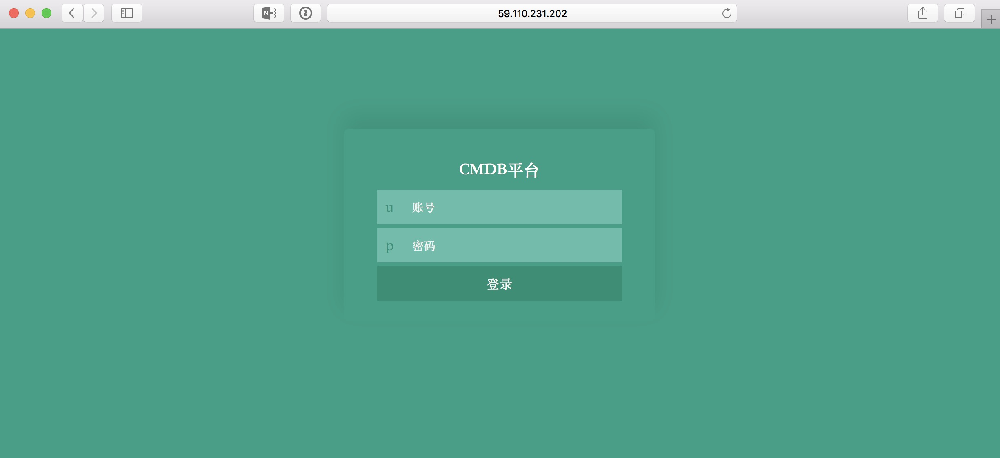
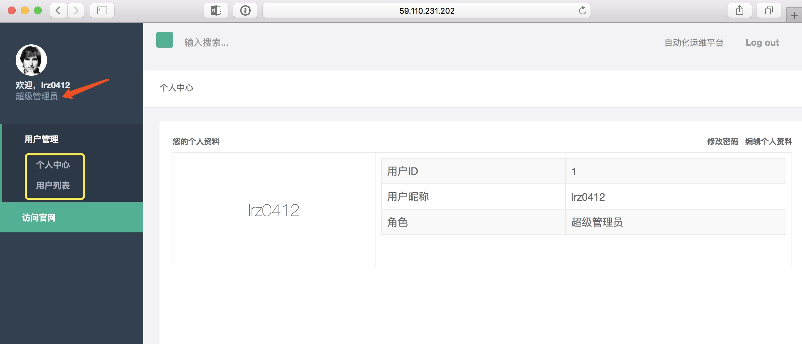
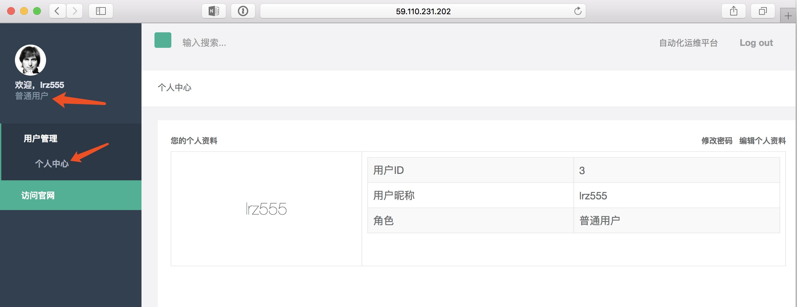
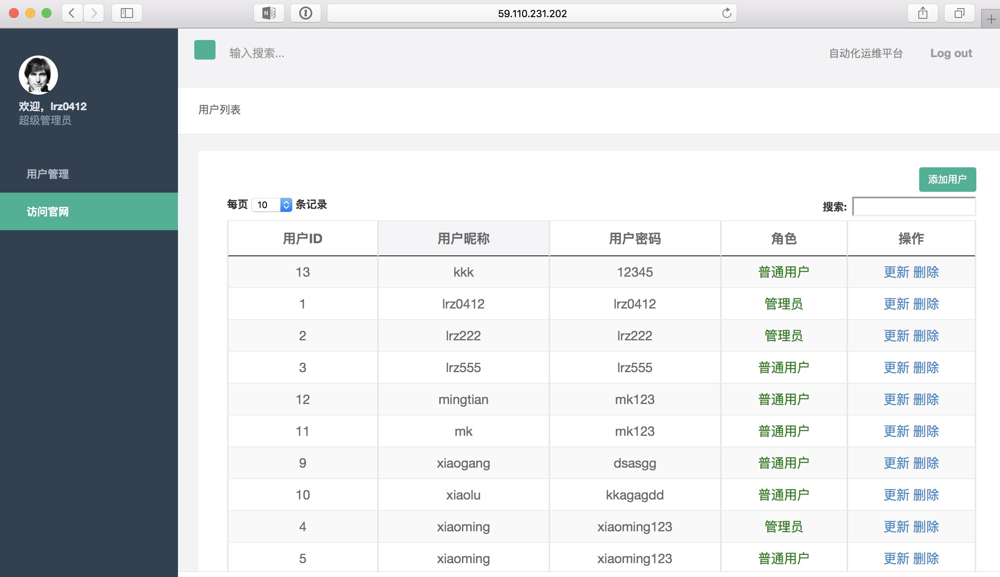
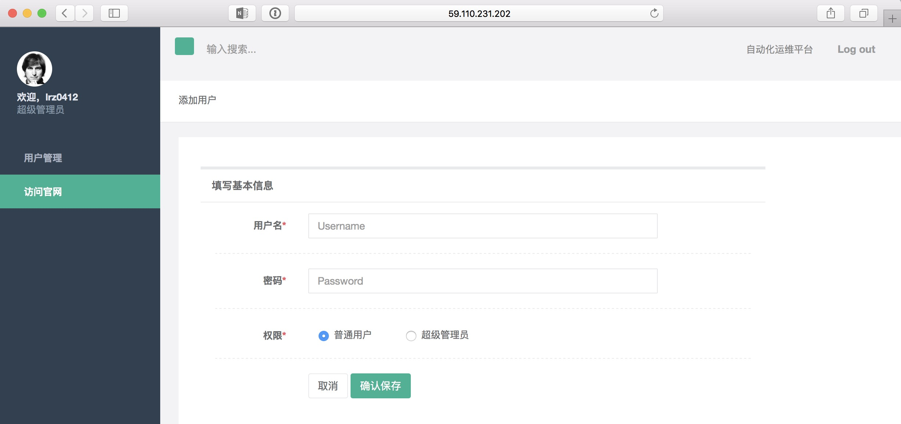

# 第七天作业

## 作业：简洁版CMDB

### CMDB介绍：
* 有五个页面（登录页面，个人信息页面，所有用户信息列表页面，增加用户信息面,更新页面）
* 登录页面（昵称，密码）
* 个人信息列表页面（登录成功后，跳至个人信息列表页面）
  * 管理员登录成功后，用户管理下拉菜单有（个人中心，用户列表）两项
  * 普通用户登录成功后，用户管理下拉菜单只有（个人中心）一项
* 所有用户信息页面（admin账号登录后，点击用户列表页面，显示所有用户信息列表）
* 增加用户信息页面（用户列表页面有增加用户按钮，点击添加按钮后，跳至添加用户信息页面，添加成功后，返回至所有用户信息页面）
* 用户列表页面，操作选项有删除按钮，点击按钮后，相应用户信息删除，并更新用户列表
* 用户列表页面，操作选项有更新按钮，点击更新后，相应用户信息更新，并更新用户列表

### 目录结构：
```
[root@LearnPython liruizhong]# tree -L 2 app/
app/
├── app.py
├── __init__.py
├── static
│   ├── css
│   ├── img
│   ├── jquery-2.1.0.js
│   ├── js
│   ├── Particleground.js
│   ├── pulgin
│   ├── style.css
│   ├── toast.js
│   ├── toastr.min.css
│   ├── toastr.min.js
│   └── verificationNumbers.js
├── templates
│   ├── add.html
│   ├── index.html
│   ├── login.html
│   ├── update.html
│   └── userlist.html
└── utils.py
```
* app.py 为主函数
* utils.py 为工具函数

### 页面展示：










