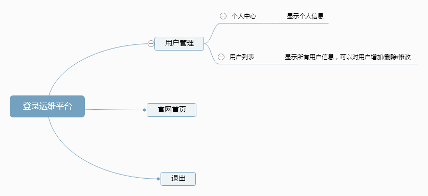
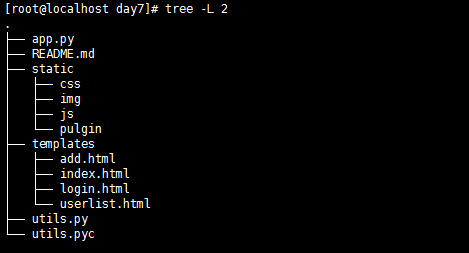
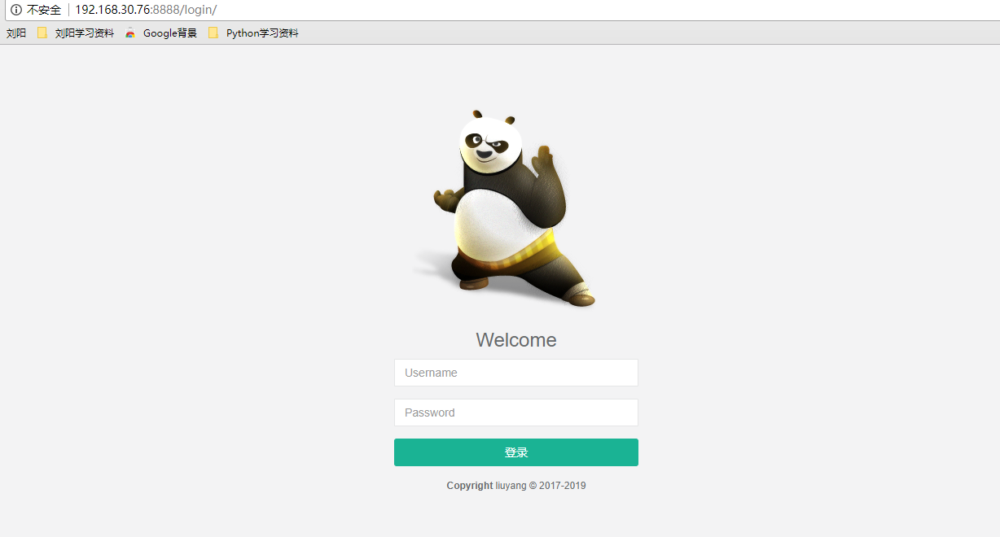
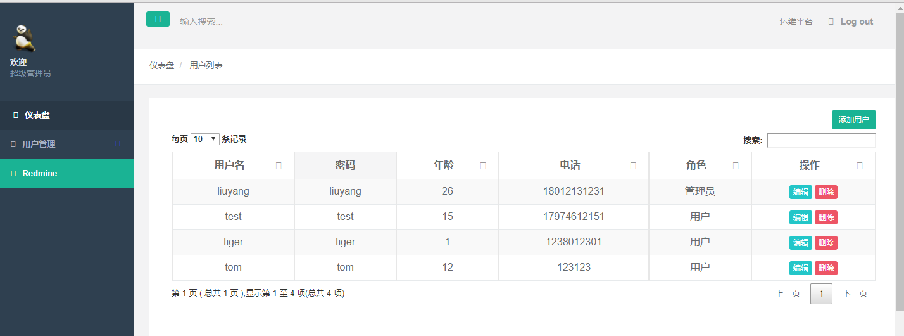
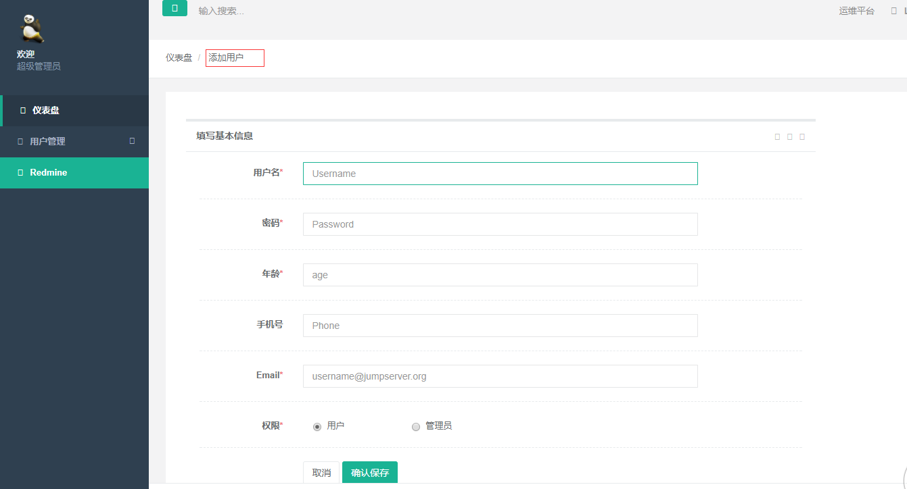
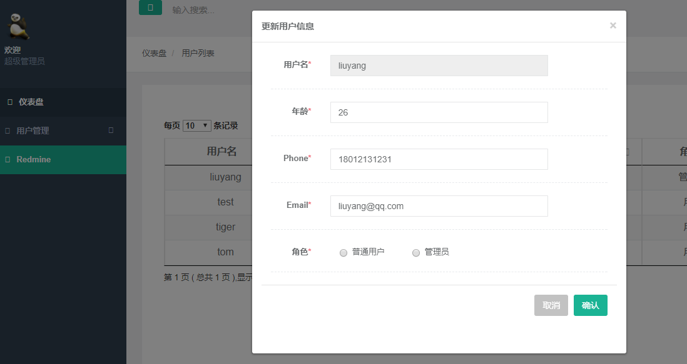

# 第7天作业
* 优化页面显示
* 用户登录 显示个人信息 添加用户 删除 修改信息（暂未实现）

## 项目分析
* 1.用户管理
    * 个人中心
    * 用户列表
* 2.Redmine 项目网站

## 项目实现
* app.py 主函数
* utils.py 功能函

## 流程图

## 目录结构

## 页面展示
##### 登录

##### 用户列表

##### 添加用户

##### 更新用户信息

