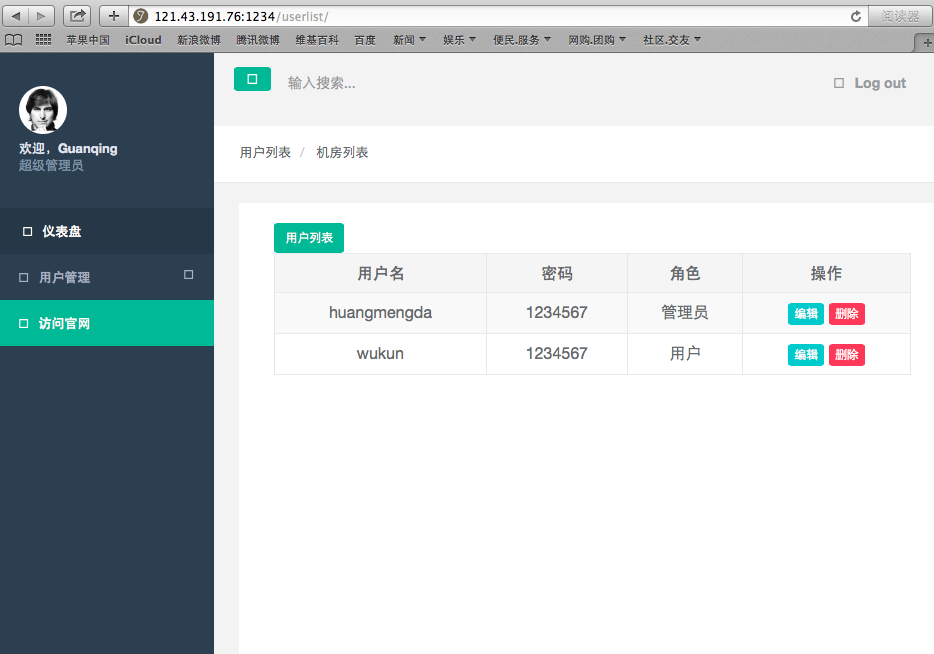

### 需求分析

* 用户权限管理系统,扒jumpserver的页面

### 目录结构
'''
├── app.py
├── README.md
├── static
│   ├── css
│   │   ├── bootstrap.min.css
│   │   └── style.css
│   ├── img
│   │   ├── facio.ico
│   │   ├── logo.png
│   │   └── root.png
│   ├── js
│   │   ├── bootstrap.min.js
│   │   └── jquery-2.1.1.js
│   └── pulgin
│       ├── datatable
│       │   ├── dataTables.min.css
│       │   └── dataTables.min.js
│       ├── Font-Awesome-4.6.3
│       │   └── css
│       │       └── font-awesome.min.css
│       ├── multiselect
│       │   ├── bootstrap-multiselect.css
│       │   └── bootstrap-multiselect.js
│       └── sweetalert-master
│           └── dist
│               ├── sweetalert.css
│               └── sweetalert.min.js
├── templates
│   ├── login.html
│   ├── reg.html
│   ├── update.html
│   └── userlist.html
├── utils.py
└── utils.pyc
'''
* app.py 为主函数
* utils.py 为工具函数
* templates 为扒来页面的html
* static 为扒来的img/css/js/pulgin

### 页面展示:

